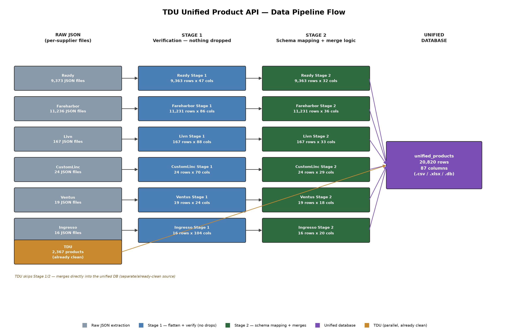

# TDU Unified Product API — Data Pipeline Summary Report

This report explains, in plain terms, how product data from six different supplier booking systems (plus TDU's own already-clean catalog) was combined into one unified database for the B2B travel agent portal. It covers what was done at each stage, the data-quality problems found along the way, and the reasoning behind the key decisions.

| Metric | Value |
|---|---|
| Supplier sources processed through the pipeline | 6 (Rezdy, Fareharbor, Livn, CustomLinc, Ventus, Ingresso) |
| Additional source merged directly (already clean) | 1 (TDU — 2,367 products) |
| Total raw source files processed | 20,835 |
| Final unified database — total rows | 20,820 |
| Final unified database — total columns | 87 |

---

## 1. Project Overview

TDU (Turtle Down Under) works with 7 different supplier booking systems, each of which exposes its product catalog in a completely different data format. The goal of this project is a single, standardized product schema that the B2B travel agent portal can browse consistently, regardless of which supplier a product actually comes from.

**TDU's own catalog (2,367 products)** was already clean and consistently structured, so it did not need to go through the multi-stage pipeline described below — it is merged directly into the final unified database as a parallel, already-finished branch.

**The other 6 sources** — Rezdy, Fareharbor, Livn, CustomLinc, Ventus, and Ingresso — each needed real processing work, because every supplier's raw data is structured differently: some nest everything under different parent keys, some use dynamic (changing) key names, some mix raw HTML into text fields, and some are missing entire categories of data (like product descriptions) that others have. The pipeline described in this report is what turns those 6 very different raw feeds into one consistent format.

---

## 2. Pipeline Stages, Explained Simply

| Stage | What Happens |
|---|---|
| **Raw Extraction** | Each supplier's raw JSON files (one file per product) are read and flattened into a simple table — nested fields become dotted column names (e.g. "supplier.name"), and list-type fields (like a list of images) are kept as-is rather than being forced into a single column. Nothing is cleaned, dropped, or renamed at this stage — it is a faithful, literal copy of what the supplier's API actually returned. |
| **Stage 1 — Verification** | Every column from the raw extraction is checked and kept — even columns that are 100% empty for a given source, since a future data pull might populate them differently. The only additions at this stage are "companion" columns (e.g. a HTML-cleaned version of a field placed alongside the original) — the original value is never overwritten. This stage is about proving nothing was silently lost, not about deciding what matters yet. |
| **Stage 2 — Schema Mapping** | This is where each source's raw column names are mapped onto TDU's unified 43-field schema (e.g. renaming a supplier-specific field to "detail_description"), genuinely internal/pipeline-only columns are dropped, and any case where the same real-world information exists in two different raw fields is resolved with an explicit, documented merge rule (see Section 4). |
| **Unified Database** | All 6 sources' Stage 2 outputs, plus TDU's already-clean catalog, are combined into one dataset keyed on product ID + source, with any remaining naming or formatting inconsistencies between sources reconciled (see Section 5). The result is delivered as a CSV, an Excel workbook, and a SQLite database, so it can be used however is most convenient downstream. |

### Pipeline Flow Diagram

---

## 3. Per-Source Summary

Each source required its own investigation, since no two suppliers structure their data the same way. The table below summarizes row counts at each stage and the single most important data-quality finding for each source.

| Source | Raw Files | Stage 1 (rows x cols) | Stage 2 (rows x cols) | Key Finding |
|---|---|---|---|---|
| **Rezdy** | 9,373 | 9,363 x 47 | 9,363 x 32 | 9,363 products AI-extracted (ChatGPT) across 9 content sections in 6 batches. Required merging a dedicated API cancellation field with an AI-parsed fallback (direct_terms + desc_cancellation), tracked which source won per row. |
| **Fareharbor** | 11,236 | 11,231 x 86 | 11,231 x 36 | Best raw detail quality of all 7 sources, but 6 fields still needed AI extraction (highlights, inclusions, itinerary, etc.) via a second "sandwich" pass over the description text, since the structured API fields alone left real gaps. Also found a look-alike false pair (cancellation_policy vs. desc_cancellation) that turned out to be the same field, HTML vs. stripped text — confirmed by reading the build code, not assumed from naming. |
| **Livn** | 167 | 167 x 88 | 167 x 33 | No AI-extraction pipeline — content comes directly from the source API. The specialNotes field packed multiple real sections (what to bring, conditions, exclusions) into one blob with internal "Label:" headers; built a label-based parser to split it into detail_what_to_bring / detail_booking_notes / detail_what_is_not_included rather than leaving it as one unstructured field. |
| **CustomLinc** | 24 | 24 x 70 | 24 x 29 | No description field at all — fundamentally a pricing/logistics feed, not a content source. Its "lowestPrice" field was always 0 (confirmed dead at the raw JSON level); the real starting price had to be derived from the minimum non-zero fare-tier price inside a nested fareTypes structure instead. |
| **Ventus** | 19 | 19 x 24 | 19 x 18 | Sparse descriptions (only 7 of 19 products have any detail text) and no internal product ID in the source JSON at all — the filename was the only reliable ID. Pricing had 8 rate-tier entries per product (Adult/Child x weekday/anyday x list/sale); confirmed the sale rate is never higher than list price before using it as the standard starting price. |
| **Ingresso** | 16 | 16 x 104 | 16 x 20 | Smallest source (16 products) with the most structurally complex raw JSON: two dynamic-key structures (events_by_id, currency_details) where the JSON key itself changed per product, which would have produced a different, misaligned column set for every single row if flattened directly. Normalized both to fixed positional keys before flattening, preserving the original key in a companion column. |

---

## 4. Key Engineering Decisions

### Compound key: product_id + source

Product IDs are NOT unique on their own — a Livn product might have ID "72" and a completely different Ventus product could also have ID "72". Every product is uniquely identified by the PAIR of (product_id, source), never product_id alone. This is enforced throughout the pipeline and is the primary key of the final database.

### The "_clean" companion column pattern

When a raw field contains messy data (raw HTML tags, inconsistent formatting, a value that looks numeric but should stay text), a new companion column is added with the fix applied — the original is never overwritten or deleted. This means it is always possible to see exactly what changed and why, and nothing is silently lost if a fix turns out to be wrong.

### Dedicated field vs. AI-extracted fallback — which one wins

For fields like cancellation policy or highlights, some products have the information in a clean, dedicated API field, while others only have it buried in unstructured description text that had to be extracted with an AI model. The rule applied consistently: the dedicated field always wins when it exists; the AI-extracted version is only used as a fallback when the dedicated field is empty. Which source actually won is tracked, so a generated/AI value is never mistaken for real supplier-provided data.

### Dynamic-key JSON normalization (Ingresso)

Ingresso's raw data used the product's own internal event code as a JSON key name (e.g. a key literally named "1DJRR"). Flattened directly, this would create a unique, one-off column for almost every product, making the data impossible to align across products. Before flattening, these dynamic keys were normalized to a fixed, predictable name (e.g. "event_1"), with the original code kept in its own column so no information was lost.

### Verified, not assumed

Several apparent shortcuts were checked against the underlying data before being trusted — for example, confirming that a field like CustomLinc's "lowestPrice" was genuinely always zero at the raw source (not a bug introduced in processing) before deriving a replacement price from elsewhere, and confirming that two similarly-named fields in Fareharbor were actually the same data in two forms (not two independent sources) by reading the underlying code rather than guessing from the field names alone.

---

## 5. Final Unified Database

The 6 processed sources' Stage 2 outputs and TDU's already-clean catalog were combined into one dataset, keyed on (product_id, source). A small number of remaining cross-source inconsistencies were reconciled at this final step: a standard "source" label was added for the sources that did not already carry one; currency and country codes were standardized to one consistent format across all sources; and a category field that had three different shapes across sources was normalized into one consistent format.

| Source | Rows in Unified Database |
|---|---|
| Fareharbor | 11,231 |
| Rezdy | 9,363 |
| Livn | 167 |
| CustomLinc | 24 |
| Ventus | 19 |
| Ingresso | 16 |
| **TOTAL** | **20,820** |

**87 total columns** in the final unified dataset. This includes every unified schema field populated by at least one source, plus a small number of source-specific supporting fields kept for completeness. The dataset is available in three formats: **unified_products.csv**, **unified_products.xlsx**, and **unified_products.db** (SQLite, single "products" table).

---

*Findings below are sourced from the full EDA notebook (`unified_products_eda.ipynb`).*

## 6. Data Quality Deep-Dive

### Missing-value breakdown (all 87 columns, worst to best)

| Column | Missing Count | Missing % |
|---|---|---|
| package_groups | 20,816 | 100.0% |
| package_type | 20,816 | 100.0% |
| transfer_name | 20,815 | 100.0% |
| transfer_pickup_hotels | 20,815 | 100.0% |
| transfer_id | 20,815 | 100.0% |
| detail_group_size | 20,813 | 100.0% |
| pickup_locations_general | 20,812 | 100.0% |
| meeting_point_notes | 20,807 | 99.9% |
| booking_lead_time | 20,805 | 99.9% |
| breakfast_details | 20,805 | 99.9% |
| event_code | 20,804 | 99.9% |
| valid_quantities | 20,804 | 99.9% |
| is_seated | 20,804 | 99.9% |
| ticket_type_details | 20,804 | 99.9% |
| venue_name | 20,804 | 99.9% |
| flight_type_id | 20,801 | 99.9% |
| has_breakfast_included | 20,801 | 99.9% |
| location_id | 20,801 | 99.9% |
| has_transfer_included | 20,801 | 99.9% |
| availability | 20,801 | 99.9% |
| non_flight_inclusions | 20,801 | 99.9% |
| booking_channel_code | 20,796 | 99.9% |
| departure_time_display | 20,796 | 99.9% |
| departure_date | 20,796 | 99.9% |
| validity_start | 20,796 | 99.9% |
| is_pickup_compulsory | 20,796 | 99.9% |
| operator_code | 20,796 | 99.9% |
| return_time | 20,796 | 99.9% |
| product_type_flag | 20,796 | 99.9% |
| validity_end | 20,796 | 99.9% |
| fare_types | 20,796 | 99.9% |
| duration_unit_source | 20,796 | 99.9% |
| product_duration_range_max | 20,794 | 99.9% |
| detail_min_age | 20,787 | 99.8% |
| detail_start_time_range_max | 20,778 | 99.8% |
| meta_supplier_phone | 20,678 | 99.3% |
| detail_start_time | 20,657 | 99.2% |
| location_source | 20,653 | 99.2% |
| meta_supplier_email | 20,653 | 99.2% |
| product_name_original | 20,653 | 99.2% |
| meta_supplier_website | 20,653 | 99.2% |
| location_end_source | 20,653 | 99.2% |
| detail_operating_days | 20,649 | 99.2% |
| product_category | 20,594 | 98.9% |
| detail_health_safety | 19,969 | 95.9% |
| detail_accessibility | 18,393 | 88.3% |
| detail_itinerary | 16,100 | 77.3% |
| duration_text | 15,691 | 75.4% |
| detail_what_is_not_included | 14,673 | 70.5% |
| product_tags | 14,160 | 68.0% |
| cancellation_days | 13,547 | 65.1% |
| detail_what_to_bring | 13,069 | 62.8% |
| duration_display | 12,060 | 57.9% |
| price_options | 11,501 | 55.2% |
| meta_supplier_name | 11,250 | 54.0% |
| meta_supplier_id | 11,250 | 54.0% |
| cancellation_hours | 9,593 | 46.1% |
| price_options_summary | 9,590 | 46.1% |
| price_including_tax | 9,590 | 46.1% |
| prototype_count | 9,589 | 46.1% |
| cancellation_type | 9,589 | 46.1% |
| is_pickup_available | 9,589 | 46.1% |
| detail_tax_percentage | 9,589 | 46.1% |
| product_duration | 8,566 | 41.1% |
| detail_booking_notes | 7,561 | 36.3% |
| detail_what_is_included | 7,486 | 36.0% |
| location_postcode | 6,093 | 29.3% |
| detail_cancellation_policy | 5,807 | 27.9% |
| location_state | 5,732 | 27.5% |
| location_street | 5,539 | 26.6% |
| location_city | 4,798 | 23.0% |
| location_latitude | 4,319 | 20.7% |
| location_longitude | 4,319 | 20.7% |
| location_country | 4,122 | 19.8% |
| detail_highlights | 3,424 | 16.4% |
| product_headline | 1,126 | 5.4% |
| product_main_image | 972 | 4.7% |
| product_images | 502 | 2.4% |
| detail_description | 286 | 1.4% |
| supplier_alias | 226 | 1.1% |
| image_count | 226 | 1.1% |
| product_currency | 187 | 0.9% |
| product_price_numeric | 10 | 0.0% |
| product_price | 10 | 0.0% |
| product_id | 0 | 0.0% |
| source | 0 | 0.0% |
| product_name | 0 | 0.0% |

The pattern is stark: the majority of columns are 90%+ missing simply because they are populated by only one or two of the six sources — this is expected given how little the raw schemas overlap, not a data-collection failure. Only 3 columns (`product_id`, `source`, `product_name`) are 0% missing across all 20,820 rows.

### Per-source fill rate — the 5 core shared columns

| Column | Rezdy | Fareharbor | Livn | CustomLinc | Ventus | Ingresso |
|---|---|---|---|---|---|---|
| product_id | 100.0% | 100.0% | 100.0% | 100.0% | 100.0% | 100.0% |
| product_name | 100.0% | 100.0% | 100.0% | 100.0% | 100.0% | 100.0% |
| product_price | 99.9% | 100.0% | 100.0% | 100.0% | 100.0% | 100.0% |
| detail_description | 99.2% | 98.6% | 100.0% | **0.0%** | 36.8% | 18.8% |
| product_images | 95.1% | 100.0% | 99.4% | **0.0%** | 100.0% | **0.0%** |

CustomLinc is 0% on both description and images — confirming it is a pure pricing/logistics feed with no content fields whatsoever. Ingresso is 0% on images (confirmed: no image field exists anywhere in its 104 raw columns) but does have some description text (18.8% of rows), contradicting a literal reading of "no description" — the real picture is "no description for most products, but not zero."

## 7. Column Group Summaries

**Identity & Core (9 columns)** — `product_id`, `source`, `product_name`, `product_name_original`, `product_headline`, `product_category`, `product_type_flag`, `product_tags`, `event_code`. Populated by all 6 sources, though only `product_id`/`source`/`product_name` are universal (0% missing) — the rest range from 5.4% missing (`product_headline`) to 99.9% missing (`product_type_flag`, CustomLinc-only). Example: Livn's `product_category` stores `["Full Day Trips & Excursions", "National Parks & Natural Attractions", "Activities"]`, while CustomLinc's stores just `["TOUR"]`.

**Pricing (11 columns)** — `product_price`, `product_price_numeric`, `product_currency`, `price_including_tax`, `price_options`, `price_options_summary`, `detail_tax_percentage`, `fare_types`, `cancellation_days`, `cancellation_hours`, `cancellation_type`. All 6 sources populate `product_price`, but the raw column mixes shapes (see Section 8) — `product_price_numeric` is the reliable one, 100% consistent, only 10 rows missing (0.0%) across the whole dataset. `detail_tax_percentage`/`price_including_tax`/`cancellation_hours`/`cancellation_type` are Fareharbor-specific (46.1% missing = exactly the 5 non-Fareharbor sources).

**Location (12 columns)** — `location_street`, `location_city`, `location_state`, `location_country`, `location_postcode`, `location_latitude`, `location_longitude`, `location_id`, `location_source`, `location_end_source`, `venue_name`, `meeting_point_notes`. Populated by all 6 sources at least partially, with `location_latitude`/`location_longitude` 20.7% missing overall. A real data-quality issue was found here: 3 products (Rezdy) have clearly wrong coordinates — e.g. "Blenheim" (New Zealand) shows `latitude=51.85`, which is a UK-region coordinate, not New Zealand's actual ~-41.5 (see Section 9 for the full outlier list).

**Description & Content (15 columns)** — `detail_description`, `detail_highlights`, `detail_what_is_included`, `detail_what_is_not_included`, `detail_itinerary`, `detail_what_to_bring`, `detail_booking_notes`, `detail_cancellation_policy`, `detail_health_safety`, `detail_accessibility`, `detail_min_age`, `detail_group_size`, `non_flight_inclusions`, `breakfast_details`, `has_breakfast_included`. Populated by 5 of 6 sources — **CustomLinc contributes nothing to this entire group** (0% on every column), confirming its "no description field" characterization applies to the whole content category, not just the description field alone.

**Images & Media (3 columns)** — `product_images`, `product_main_image`, `image_count`. Populated by only 4 of 6 sources (Rezdy, Fareharbor, Livn, Ventus) — **CustomLinc and Ingresso have zero image data**, matching CLAUDE.md's documented finding for Ingresso and extending the same conclusion to CustomLinc.

**Booking & Logistics (27 columns)** — the largest group, covering scheduling, pickup/transfer, and ticket-type fields (`product_duration`, `detail_operating_days`, `departure_date`, `transfer_pickup_hotels`, `package_groups`, etc.). Almost every column here is a single-source specialty field (99%+ missing) — e.g. `package_groups`/`package_type`/`transfer_name`/`transfer_pickup_hotels` are 100% or 99.9%+ missing because they only exist for CustomLinc (package structures) or Ventus (transfer hotel lists) respectively.

**Metadata & Supplier (9 columns)** — `meta_supplier_id`, `meta_supplier_name`, `meta_supplier_email`, `meta_supplier_phone`, `meta_supplier_website`, `supplier_alias`, `operator_code`, `booking_channel_code`, `flight_type_id`. `meta_supplier_id`/`meta_supplier_name` are 54.0% missing (populated by 4 of 6 sources: Rezdy, Livn, CustomLinc, Ingresso — matching CLAUDE.md's documented source list for these fields); `meta_supplier_email`/`phone`/`website` are Livn-exclusive (99.2%+ missing elsewhere).

## 8. Cross-Source Inconsistencies (False-Friend Columns)

These are columns where the SAME column name hides genuinely different value shapes or formats depending on source — found and reconciled during the unified-database merge.

**`product_price`** — same column name, different shape entirely for one source:

| Source | Raw `product_price` value |
|---|---|
| Rezdy | `69.0` |
| Fareharbor | `62.73` |
| **Livn** | **`[{"amount": 189, "currency": "AUD"}]`** |
| CustomLinc | `25` |
| Ventus | `311.2` |
| Ingresso | `24.0` |

Livn stores a JSON list of `{amount, currency}` objects rather than a plain number — any code that assumes `product_price` is always a number will break on Livn's 167 rows. This is exactly why `product_price_numeric` was added as a companion column (extracts `.amount` for Livn, passes the value through unchanged for everyone else) — it is 100% numeric and safe to use directly.

**`product_category`** — 3 different raw shapes before normalization:

| Source | Original raw shape | Example |
|---|---|---|
| Livn | List of `{id, name}` objects | `[{"id": 10, "name": "Full Day Trips & Excursions"}, ...]` |
| CustomLinc | Plain string | `"TOUR"` |
| Ventus | Plain string | `"General Flight"` |
| Ingresso | List of strings | `["Attractions", "Family"]` |

All 4 shapes were normalized into one consistent JSON string-list format during the merge (e.g. Livn's objects reduced to just their `name` values) — the CSV now shows a single consistent shape for every row, but the underlying source data genuinely differed before that step.

**`location_country` / `product_currency`** — casing and format inconsistencies, now normalized:

| Column | Distinct values by source (post-normalization) |
|---|---|
| location_country | Rezdy: AT, AU, ID, JP, MX, MY, NC, NF, NZ · Fareharbor: AU, NZ, TH · Ingresso: AU, NZ, US · Livn: AU |
| product_currency | Rezdy: AUD, EUR, NZD, USD · Fareharbor: AUD, NZD · Ingresso: AUD, NZD · CustomLinc: AUD |

Before normalization, the same country/currency was represented inconsistently across sources (e.g. `"au"` vs `"AU"` vs `"Australia"`; `"aud"` vs `"AUD"`) — all now uppercased and mapped to standard 2-letter/3-letter codes.

## 9. Known Limitations

- **CustomLinc: 0/24 products have a description (0.0%)** and 0/24 have any image data (0.0%) — confirmed a pure pricing/logistics feed with no content fields at all, not a gap in extraction.
- **Ventus: 7/19 products have description text (36.8%)** — the majority of Ventus products have no detail text available from the source.
- **Ingresso: 3/16 products have description text (18.8%)**, and 0/16 have any image data (0.0%) — CLAUDE.md's "no description or images" note is only partially accurate: images are genuinely always absent, but a small minority of products do carry real description text.
- **Ingresso's per-product pricing does vary genuinely** ($20.00–$103.36 across its 16 products) — the "fixed" pricing pattern found during Stage 2 build referred to a single product's own min/max price-range fields being identical (i.e., no price range within one product, a single fixed price per ticket type), not identical prices across different products.
- **3 Rezdy products have clearly incorrect GPS coordinates** — "Blenheim" (should be New Zealand, ~-41.5° latitude) is recorded at 51.85° latitude, a UK-region value; "Blackheath" and "Exmouth" show similar out-of-region latitudes. These 3 rows are the extreme high end of the `location_latitude` distribution (see Section 10) and should be treated as raw-source data errors, not pipeline bugs — the pipeline preserved these coordinates faithfully from the raw API rather than validating or correcting them.
- **One extreme price outlier**: Fareharbor product "A2O Full Tours" (ID 453400) shows a `product_price_numeric` of $483,478.26 — over 100x the next-highest price in the dataset. This is almost certainly a data entry or currency-unit error at the source (e.g. cents stored as dollars, or a multi-passenger group total mistakenly stored as a per-person price) and should be flagged for supplier follow-up before this product is surfaced in the portal.

## 10. Numeric Field Statistics

| Field | Count | Min | 25th % | Median | 75th % | Max | Mean |
|---|---|---|---|---|---|---|---|
| product_price_numeric | 20,810 | $0.00 | $75.00 | $175.00 | $400.00 | $483,478.26 | $664.23 |
| location_latitude | 16,501 | -46.93° | -37.86° | -33.86° | -27.88° | 51.85° | -31.77° |
| location_longitude | 16,501 | -123.34° | 144.13° | 151.20° | 153.52° | 178.32° | 145.61° |

**Top 5 highest-priced products** (all plausible except the top outlier):

| Rank | Product ID | Source | Product Name | Price |
|---|---|---|---|---|
| 1 | 453400 | Fareharbor | A2O Full Tours | **$483,478.26** ⚠ outlier |
| 2 | PYM74F | Rezdy | Annual Brisbane Riverfire Weekender | $199,199.00 |
| 3 | PDETW9 | Rezdy | 10 Days/9 Nights Luxury catered private cruise, Marlborough Sounds NZ | $100,090.00 |
| 4 | 702142 | Fareharbor | Catered 7 Day Getaway on the Gold Coast | $90,908.18 |
| 5 | PZ8099 | Rezdy | 9 Days/8 Nights Luxury catered private cruise, Marlborough Sounds NZ | $90,465.00 |

Ranks 2–5 are genuine high-value multi-day luxury cruise/event packages and are plausible as-is. Rank 1 stands apart — nearly 2.5x the next-highest value and disconnected from any comparable multi-day package naming — and is the single clearest candidate for a data-correction request back to Fareharbor.

**Latitude/longitude range**: the bulk of the data (25th–75th percentile) sits within Australia/New Zealand's expected range (-37.9° to -27.9° latitude), consistent with the supplier base — the 3 outlier coordinates noted in Section 9 are the reason the max latitude (51.85°) sits well outside that expected range.
